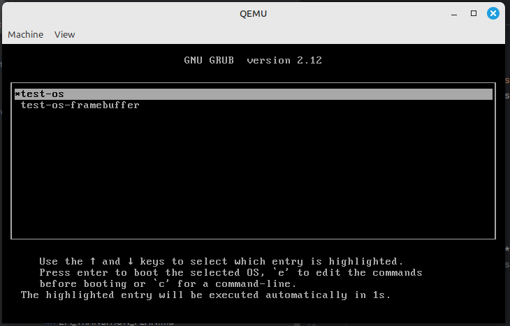
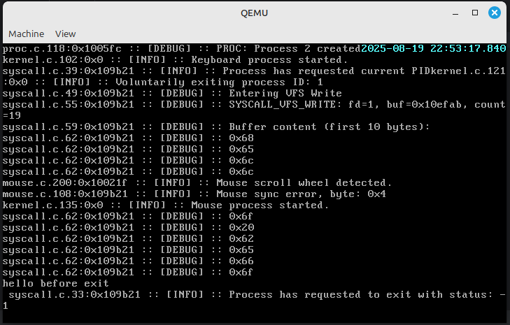
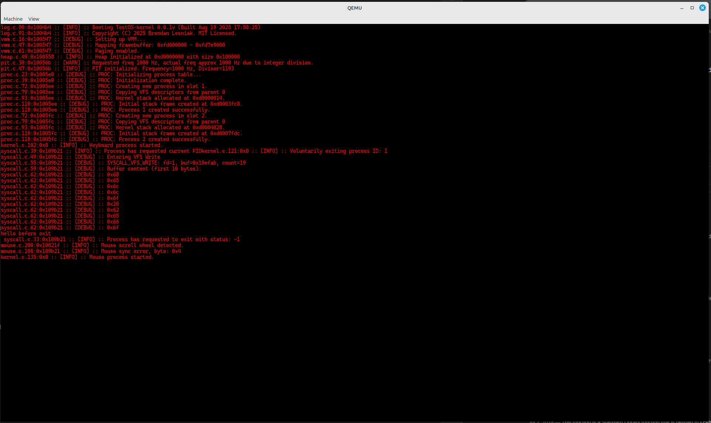

# BrenOS


## Project Overview

BrenOS 32-bit operating system developed from scratch, primarily in C and i386 assembly. The goal is to an understanding of how operating systems work, from initial kernel boot to advanced kernel functionalities like memory management, process scheduling, and basic device drivers. This OS is designed, using various resources around the internet, by myself for educational purposes and serves as a learning platform for low-level system programming.

## Current State & Features

### Bootloader
*   **GRUB:** Utilizes GRUB as the bootloader to load the kernel, configured via `grub/grub.cfg.in`. It supports Multiboot specification for passing system information to the kernel. It currently has 2 supported boot modes, one using the VGA Text Mode, and the other using a Framebuffer that GRUB sets up for the kernel. 

### Kernel Core
*   **32-bit C Kernel:** The main kernel is written in C, with critical low-level routines implemented in i386 assembly.
*   **Global Descriptor Table (GDT):** Configures memory segmentation for the kernel and user-mode processes, including a Task State Segment (TSS) for context switching.
*   **Interrupt Descriptor Table (IDT):** Sets up handlers for CPU exceptions and hardware interrupts (ISRs, IRQs, etc).
*   **Programmable Interrupt Controller (PIC):** Remapped to avoid conflicts with CPU exceptions.
*   **Logging:** A basic logging system outputs messages to both the serial port (COM1) and the screen, with different log levels (DEBUG, INFO, WARN, ERROR, PANIC).

### Memory Management
*   **Physical Memory Manager (PMM):** A bitmap-based allocator manages physical memory pages (4KB blocks), tracking available and used pages.
*   **Virtual Memory Manager (VMM):** Implements paging, enabling virtual memory addresses for processes. It includes identity mapping for initial setup and a page fault handler for memory access violations.
*   **Kernel Heap:** Provides dynamic memory allocation within the kernel using `kmalloc`, `kfree`, and `krealloc`, built on top of the VMM and PMM.

### Drivers
*   **Screen & Console:** Supports both VGA text mode and framebuffer (GUI) output, dynamically selected based on Multiboot information. Includes basic character drawing and scrolling capabilities (Text-Mode only at the moment).
*   **Keyboard:** A PS/2 keyboard driver handles scancodes, converting them to ASCII characters and recognizing special keys (e.g., arrow keys, Page Up/Down).
*   **Mouse:** A PS/2 mouse driver processes mouse packets, tracking movement and button presses, including scroll wheel and extended buttons.
*   **PIT (Programmable Interval Timer):** Configured to generate periodic interrupts, serving as the primary timer for the system and driving the scheduler.
*   **Real-Time Clock (RTC):** Reads the current time from the CMOS chip, maintaining an accurate system time and Unix timestamp.
*   **Serial Port:** Basic driver for serial communication (COM1), primarily (read: only) used for debugging output.

### Process Management
*   **Process Creation:** Supports the creation of new processes, each with its own kernel stack.
*   **Round-Robin Scheduler:** A simple scheduler distributes CPU time among active processes (TDM), enabling multitasking.
*   **Kernel & User Mode:** Processes can execute in both privileged kernel mode and unprivileged user mode, with proper privilege separation (WIP, currently broken!)
*   **Context Switching:** Saves and restores process state during context switches.

### System Calls (Syscalls)
*   Basic syscall interface for user-mode interaction (e.g., `sys_yield`, `sys_exit`, `sys_pid`, `sys_vfs_write`).

### Virtual File System (VFS)
*   A rudimentary VFS layer is in place, abstracting device interactions. Currently, it provides a file descriptor for the terminal, allowing processes to write output.
*   VFS descriptors are inhereited between parent/child processes

### Time Management
*   The system maintains a global Unix timestamp, updated by the RTC interrupt and refined by the PIT. It provides functions to convert timestamps to human-readable date and time components.

## Screenshots

### GRUB Boot Menu


### Post-Initialization (Text Mode)


### Post-Initialization (Framebuffer Mode)


## Getting Started

To get this project up and running, you'll need a few prerequisites and then follow the build and run steps.

### Prerequisites

*   **GCC Cross-Compiler for i686-elf:** This project requires a cross-compiler targeting `i686-elf`. You can build one using the provided `.toolchain/build-cross.sh` script.
*   **GNU GRUB:** GRUB is used as the bootloader.
*   **QEMU:** QEMU is used for emulating the hardware to run the OS.
*   **Make:** For building the project.

### Environment Setup (Downloads dependencies, builds the cross compiler, ...)

```bash
./env-setup.sh
```

### Building the OS

```bash
make clean && make
```

### Running the OS in QEMU

```bash
make run
```

## For Developers

This section provides some notes for those looking to dive into the codebase.

*   **Boot Process:** `arch/i386/boot.s` for the initial boot sequence and `kernel/kernel.c` for the kernel entry point.
*   **Interrupts and GDT/IDT:** The `arch/i386/` directory contains the core assembly and C files for setting up the Global Descriptor Table (GDT), Interrupt Descriptor Table (IDT), and interrupt handlers.
*   **Drivers:** Basic drivers for screen output (`drivers/screen.c`, `drivers/terminal.c`, `drivers/framebuffer_console.c`, `drivers/text_mode_console.c`) and keyboard input (`drivers/keyboard.c`) are located in the `drivers/` directory.
*   **Memory Management:** `arch/i386/vmm.c` and `arch/i386/pmm.c` are the virtual and physical memory managers respectively. 
*   **Toolchain:** The `.toolchain/` directory contains scripts and source code for building the necessary cross-compiler and debugging tools. Ensure your `PATH` includes the cross-compiler's `bin` directory.
*   **Debugging:** For debugging, ensure QEMU is running in debug mode (e.g., `make debug`). Then, use the `i686-elf-gdb` from your toolchain. You can load the provided `gdb.script` to set up common breakpoints and symbols. For proper source-level debugging, ensure you load the kernel binary with debugging symbols.

    Example GDB command:
    ```bash
    ./.toolchain/cross/bin/i686-elf-gdb -x gdb.script .toolchain/iso/boot/test-os.bin
    ```
    
    Once in GDB, connect to QEMU:
    ```
    (gdb) target remote :1234
    ```
    (Assuming QEMU is listening on port 1234, which `make debug` typically aconfigures.)
